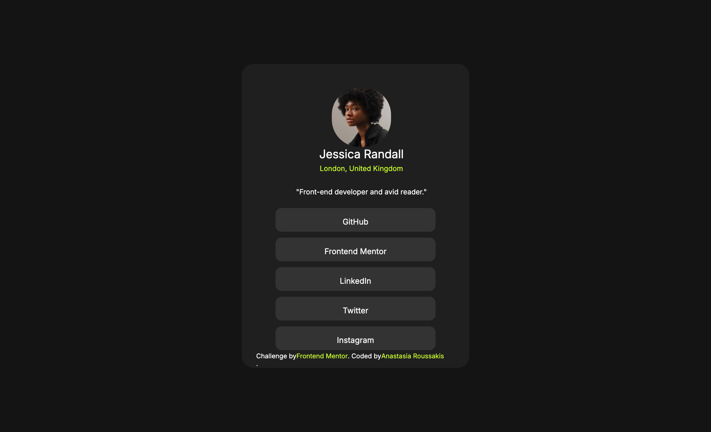

### Screenshot

Add a screenshot of my solution. 

### Links

- Solution URL: [Add solution URL here](https://github.com/AnnaRouss/social-links-profile-main)
- Live Site URL: [Add live site URL here](https://annarouss.github.io/social-links-profile-main/)

### Built with

- Semantic HTML5 markup
- CSS custom properties
- Flexbox
### what I learned
By using Flexbox more, I was able to recreate this challenge without too much of a struggle. Also learned the spacing of items better.

### Continued development

Practice definitely, makes perfect, the more I do these the better I do with the outcome of what I am supposed to create. It is also fun to challenge myself.

### Useful resources

- [Flexbox Properties](https://css-tricks.com/snippets/css/a-guide-to-flexbox/#aa-flexbox-properties) - This helped me figure out out to align my content properly.

## Author

- Website - [Anastasia Roussakis](https://github.com/AnnaRouss)
- Frontend Mentor - [@AnnaRouss](https://www.frontendmentor.io/profile/AnnaRouss)

## Acknowledgments

My husband Kevin Stacey helped me when I was stuck as well as ChatGPT when I was suuuper stuck.

